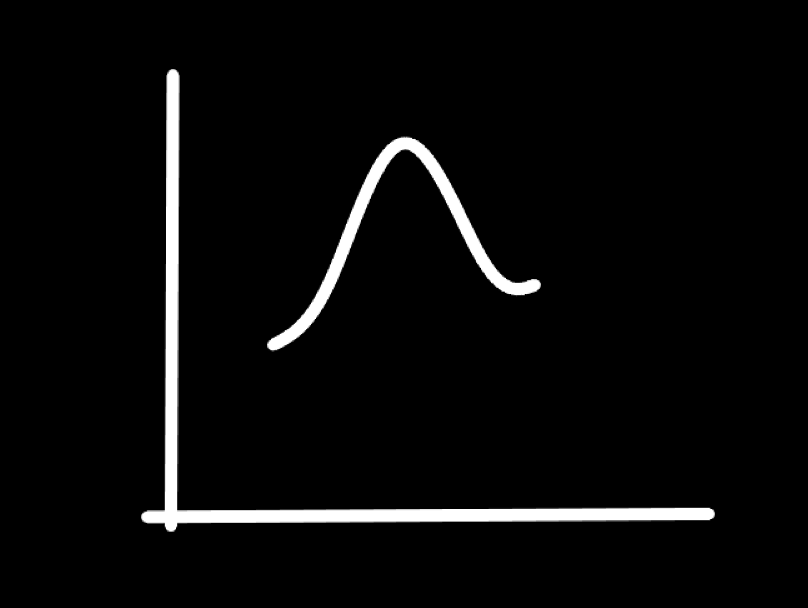

## Reaction mechnism 🧪

note: Welcome , I am trying to make new type of content which is fast paced educational content, with animated asthetic looks. I hope you like it.
Lets start

---

## So , What is reaction in Our context?

> 

note: lets be simple here in our context, reaction is just a procees by which the reactants gets converted into Products in presene of Reagents/Catalyst.
the reaction may involve one or more steps.

---

(i) n Steps  -> n Transition States -> (n-1) Intermediates -> n Products

note: If a reaction has n steps then it will have n transition states and (n-1) intermediates and n products.
this is straightforward

---

(ii) Transition State -> Bonds are broken or Bonds are formed
these are less stable activated compound

note: Transition state is a activated compound which is less stable and it is formed when bonds are broken or bonds are formed.

---

(iii) Energetics -> It shows energy change with the progress of reaction

$$
\Delta G = \Delta H - T \Delta S
$$

note: Remember Thermodynamics ? Energetics comes from same place It tells us about the energy change with the progress of reaction with the help of Gibbs free energy equation.

---

(iv) Kinetics -> It shows rate of reaction with the progress of reaction

$$
xA + yB + zC \rightarrow D
$$

$$
Rate = \frac{d[D]}{dt} = k[A]^x[B]^y[C]^z
$$

$$
Order = x + y + z
$$

note: Kinetics tells us about the rate of reaction with the progress of reaction with the help of rate law equation Which you learn in CHemicla kinetics chapter ; it states that rate of reaction is directly proportional to the concentration of reactants raised to the power of their stoichiometric coefficient.
Also here,the sum of stoichiometric coefficient is called order of reaction.

---

Lets see some graphs

---

<!-- // graphs todo -->

---

## Types of Reactions

> Acid-Base Addition Substitution Elimination
>> AB ASE
(order of priority of reaction)

note: Types of Reactions can be classified into 4 types based of their priority

---

* AB : Acid Base Reactions
* A : Addition Reactions
* S : Substitution Reactions
* E : Elimination Reactions

note: we can remember it as ABASE , where AB is acid base , A is Addition , S is for Substitution and E is for Elimination.
this order comes from thermodynamics we can say then acid base reactions are most exothermic and elimination reactions are least exothermic or even we can call them endothemic.
for current context will not look at acid base reaction as we have alredy done it in GOC-II.

---

**Addition Reactions**

`A=B` + `x-y` -> `x-A-B-y`

* Nucleophilic Addition $N_A$ -> `C=A` or `C≡A` (A = N,P,S,O)
* Electrophilic Addition $E_A$ -> `C=C` or `C≡C`
* Free Radical Addition $R_A$ -> `C=C` or `C≡C`

note: First we will look at Addition Reactions, addition can be furthern classified into 3 types
Nucliophilic  Addition
Electrophilic Addition
Free Radical Addition

nucliophilic addition is when carbon is attached to a electronegative atom like N,P,S,O via double or triple bond.
Electrophilic addition is when carbon is attached to a carbon via double or triple bond.
Free radical addition is when carbon is attached to a carbon via double or triple bond.
Electrophilic addition and Free radical addition can occur in same reaction.

---

Lets do some question

// insert questions

---

**Subsititution Reactions**

`A-x` + `y` -> `A-y` + `x`

* Nucleophilic Substitution $N_S$ -> leave group must be present
* Electrophilic Substitution $E_S$ -> Aromatic ring must be present
* Free Radical Substitution $R_S$ -> `-H` attached to $sp3$ carbon

note: Substitution Reactions can be further classified into 3 types
Nucliophilic  Substitution
Electrophilic Substitution
Free Radical Substitution
It is very simple to remember that if a leaving group is present then it is nucleophilic substitution and if aromatic ring is present then it is electrophilic substitution and if `-H` is attached to $sp3$ carbon then it is free radical substitution.
also we have studied leaving group earlier so not discussing it here.

---

Lets do some question

// insert questions

---

# Thank You

I hope you liked the video i made

---
