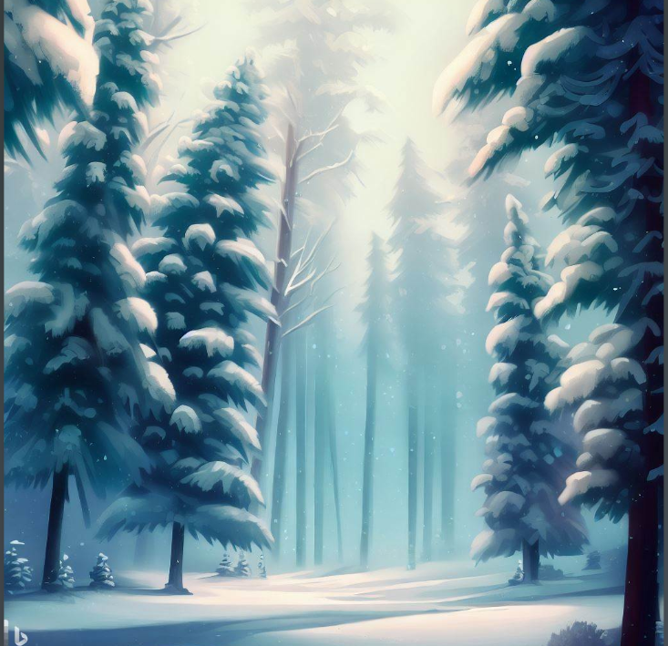
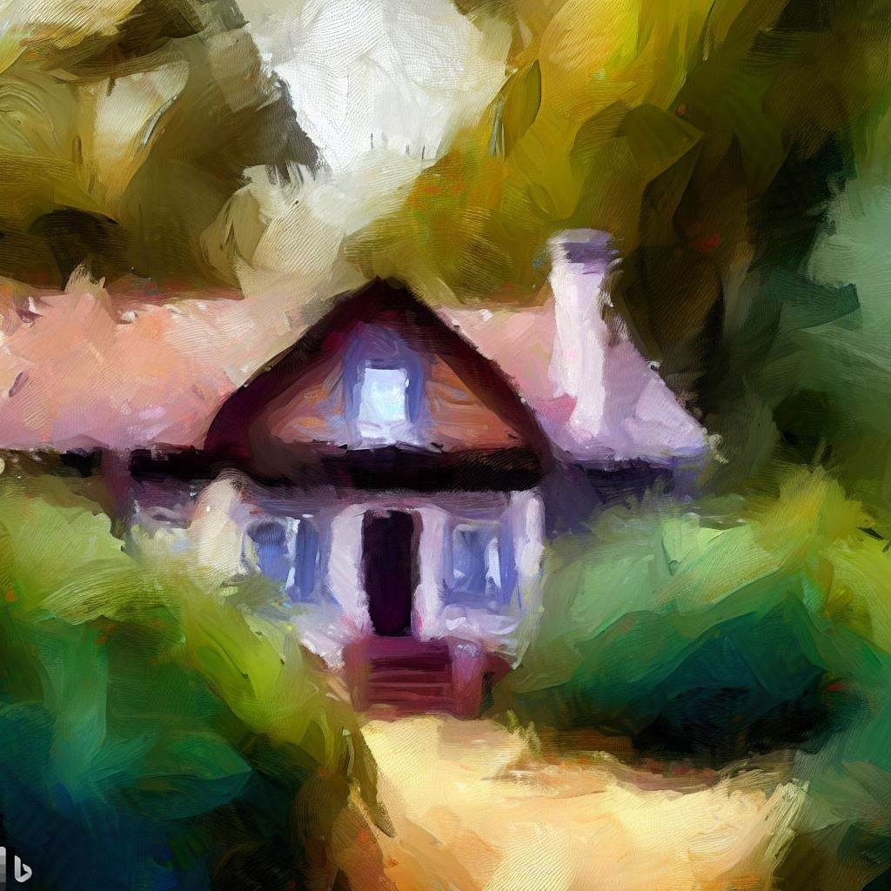

# The Rattrap by Selma Lagerlöf

---

**Introduction**
Welcome to the world of "The Rattrap"! In this video, we'll explore the captivating tale of a wandering peddler and his encounters.

---

**Scene 1: The Snowy Forest**
Visualize a serene winter forest with tall pine trees covered in glistening snow. The weary peddler trudges through the snow, his rattraps in hand.

---
